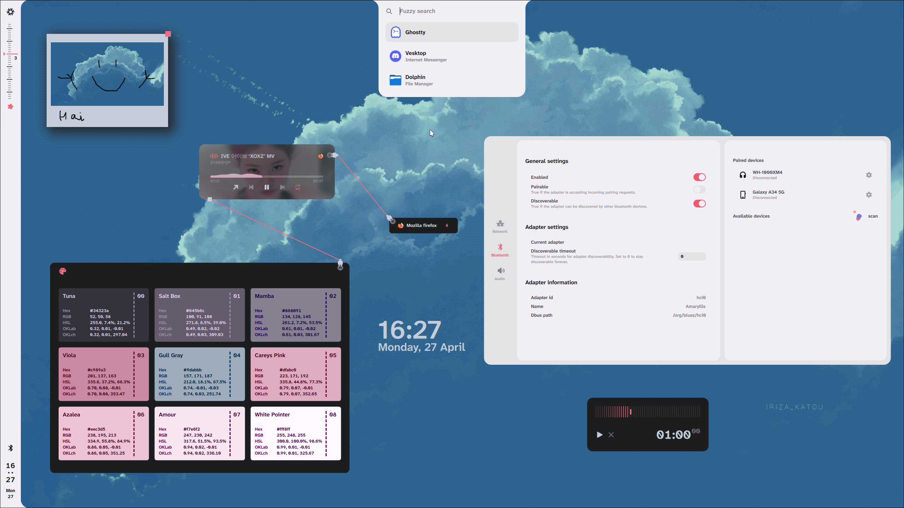

<h2>Greenhouse</h2>

My Nixos configuration (Flakeless + dendritic pattern)

 

 

The entry point is [./modules/hosts](modules/hosts)

 

## Features
+ [modules/hosts/default.nix](modules/hosts/default.nix) Automatic host creation
+ [utils/_recursiveImport](utils/_recursiveImport.nix) 
    + see [./default.nix](default.nix) for example usage
+ [Impure symlink](utils/_mkStoreSymlink.nix) dotfiles experience like in traditional UNIX systems
    + see ./modules/hosts/hostName/hjem/username/username.nix for example usage
+ [Nvim config](/modules/hosts/Amaryllis/hjem/vsmrf/_config/neovim/nvim/lua/vismorf/config)
    + [root finder](modules/hosts/Amaryllis/hjem/vsmrf/_config/neovim/nvim/lua/vismorf/plugins/rootf.lua)
    + [vim mode in cmdline with some qol features](modules/hosts/Amaryllis/hjem/vsmrf/_config/neovim/nvim/lua/vismorf/config/keymaps.lua)
    + [restore last session](modules/hosts/Amaryllis/hjem/vsmrf/_config/neovim/nvim/lua/vismorf/config/backend)
+ [Just recipes](Justfile)

## Credits
+ [Rexcrazy804/Zaphkiel](https://github.com/Rexcrazy804/Zaphkiel)
+ [denful/dendritic-unflake](https://github.com/denful/dendritic-unflake)
+ [dendritic pattern guide](https://github.com/Doc-Steve/dendritic-design-with-flake-parts)
+ [pinning with npins blog by Jade](https://jade.fyi/blog/pinning-nixos-with-npins/)
+ [pinning with npins blog by piegames](https://piegames.de/dumps/pinning-nixos-with-npins-revisited/)
